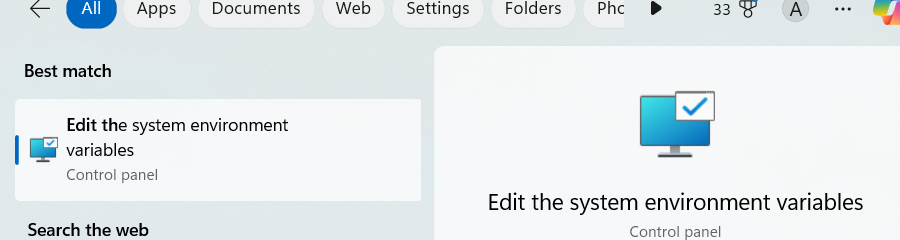
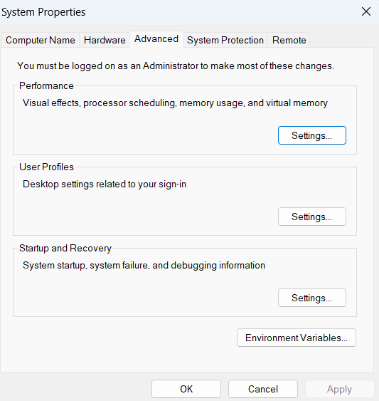
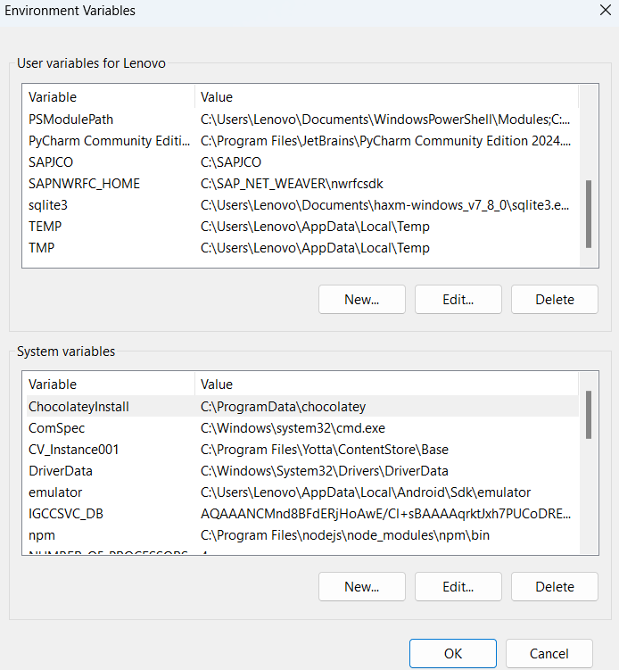
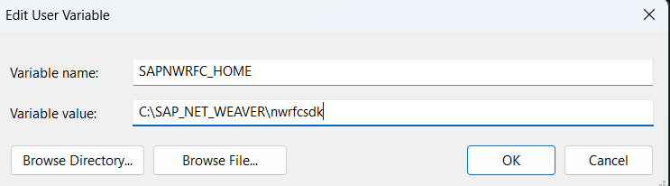
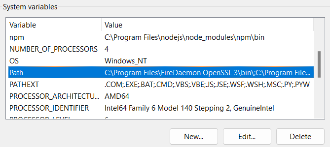
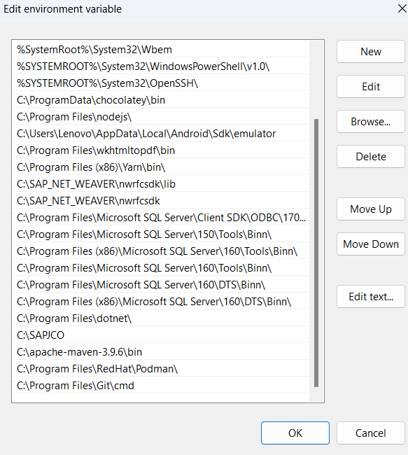
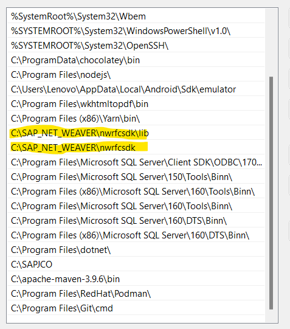

# SapTableUpload
Python Program to upload data from SAP To Target

## Prequisite:
* [Python 12](https://www.python.org/downloads/) or higher needs to be installed
* Set up SAPNWRFC_HOME environment
  * #### Windows
    * Download [nwrfcsdk](https://support.sap.com/en/product/connectors/nwrfcsdk.html) from SAP website
    * Extract the downloaded zip file into C drive and rename the folder to **nwrfcsdk**
      
      
      * **Note: In this example we have saved the content in C drive in folder 
        called SAP_NET_WEAVER**
    * Open Start Menu and open **Edit the system environment variables**
    
      
      
      
    * Click on **Environment Variables** at the right bottom
    
      
    * Click on **New** button under **User Variables** and add SAPNWRFC_HOME as name and the path to **nwrfcsdk** in
      the path and then press **OK** button 
    
      
    * Under **System Variables** look for an entry name **Path**
      
      
    * Click **Edit..** button

      
    * Click on **New** button and add the path to **bin** folder inside **nwrfcsdk** and then click on
      **New** button again and add the path **nwrfcsdk** folder
      
      
    * Click **OK** button in all the windows open
    
    

